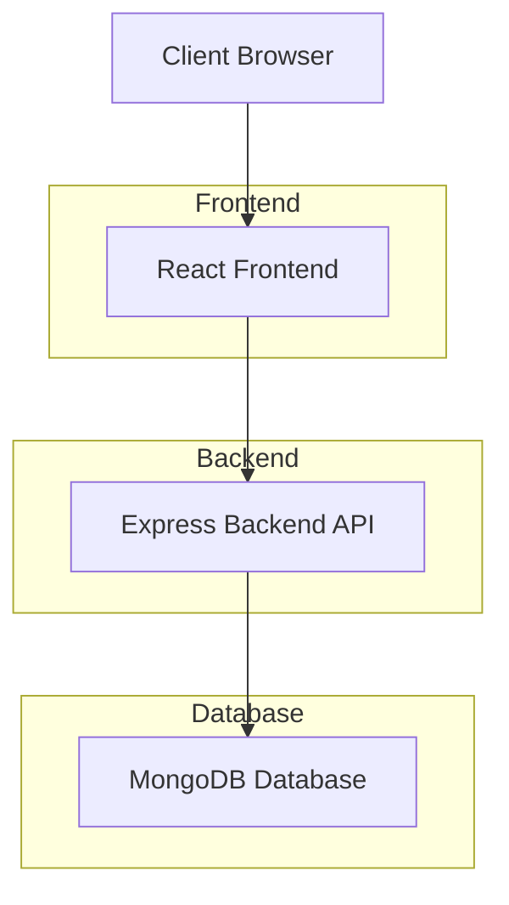
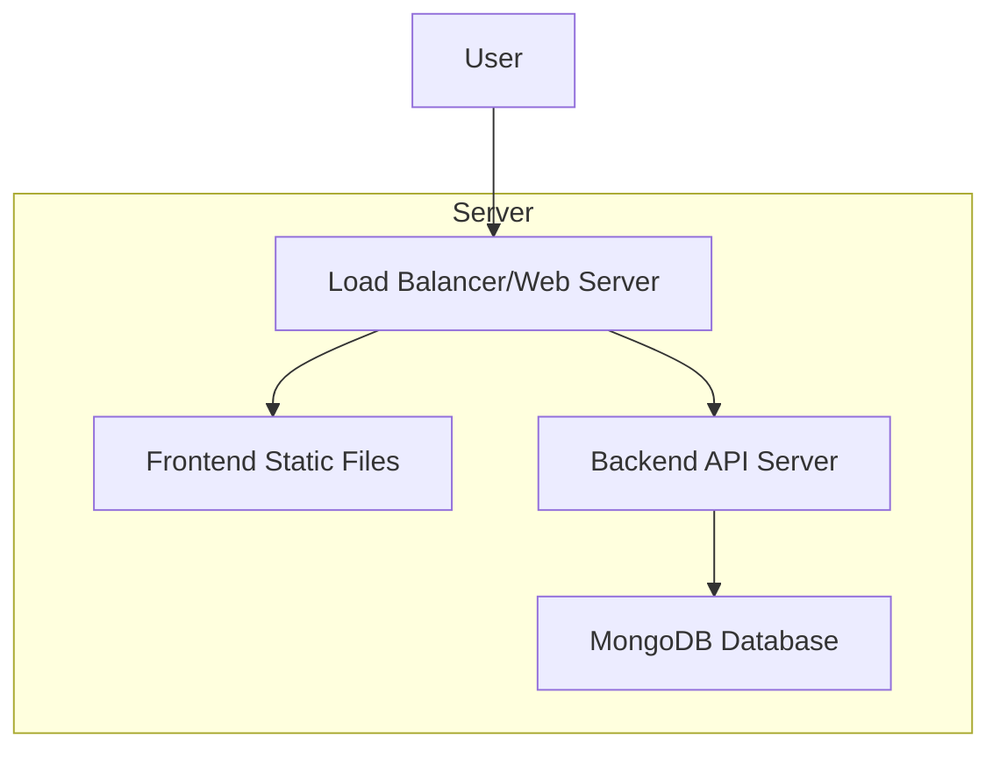

# Portfolio Website Architecture

## System Overview

## Component Details

### Frontend (React.js)
- Built with Vite for fast development
- Responsive design using CSS Grid and Flexbox
- Components:
  - Header/Navigation
  - Hero Section
  - Projects Showcase
  - About Section
  - Contact Form
  - Footer

### Backend (Node.js + Express)
- RESTful API endpoints
- MongoDB integration with Mongoose ODM
- CORS enabled for frontend communication
- Environment-based configuration

### Database (MongoDB)
- Two collections:
  - Projects: Stores project information
  - ContactMessages: Stores contact form submissions

## Data Flow

1. User visits the website
2. React frontend loads and makes API requests to backend
3. Express backend receives requests and queries MongoDB
4. Data is returned to frontend and displayed to user
5. User interactions (form submissions) are sent to backend
6. Backend saves data to MongoDB

## Deployment Architecture

